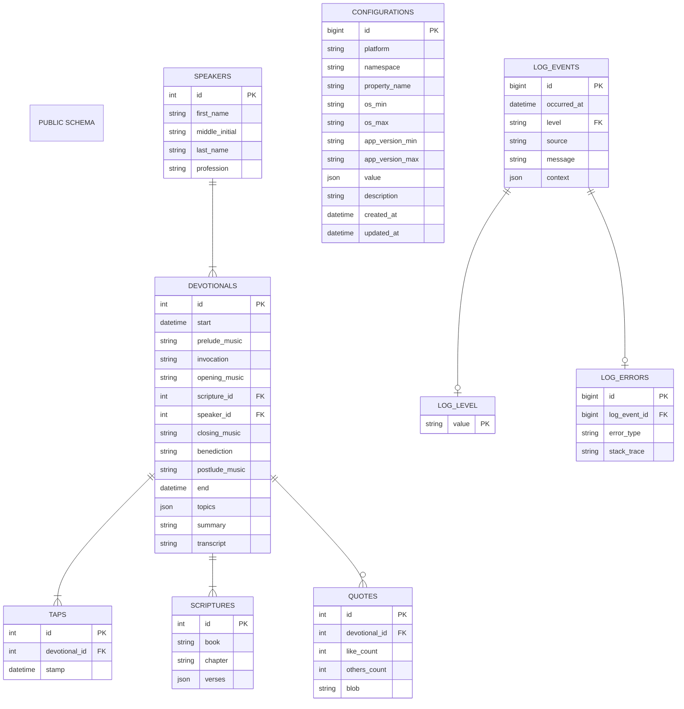

```mermaid
erDiagram "PUBLIC SCHEMA"
    DEVOTIONALS {
        int id PK
        datetime start
        string prelude_music
        string invocation
        string opening_music
        int scripture_id FK
        int speaker_id FK
        string closing_music
        string benediction
        string postlude_music
        datetime end
        json topics
        string summary
        string transcript
    }

    SCRIPTURES {
        int id PK
        string book
        string chapter
        json verses
    }

    SPEAKERS {
        int id PK
        string first_name
        string middle_initial
        string last_name
        string profession
    }

    TAPS {
        int id PK
        int devotional_id FK
        datetime stamp
    }

    QUOTES {
        int id PK
        int devotional_id FK
        int like_count
        int others_count
        string blob
    }

    CONFIGURATIONS {
        bigint id PK
        string platform
        string namespace
        string property_name
        string os_min
        string os_max
        string app_version_min
        string app_version_max
        json value
        string description
        datetime created_at
        datetime updated_at
    }

    LOG_EVENTS {
        bigint id PK
        datetime occurred_at
        string level FK
        %% os.namespace.property (i.e: ios.auth.logoff)
        string source
        string message
        json context
    }

    %% enum
    %% debug	Diagnostic info for developers
    %% info 	Normal application events
    %% warn	    Unexpected but recoverable
    %% error	Failure of an operation
    %% fatal	App cannot continue
    LOG_LEVEL { 
        string value PK
    }

    LOG_ERRORS {
        bigint id PK
        bigint log_event_id FK
        %% i.e AuthenticationError
        string error_type
        string stack_trace
    }

    LOG_EVENTS ||--o| LOG_LEVEL : ""
    LOG_EVENTS ||--o| LOG_ERRORS : ""
    SPEAKERS ||--|{ DEVOTIONALS : ""
    DEVOTIONALS ||--|{ TAPS : ""
    DEVOTIONALS ||--|{ SCRIPTURES : ""
    DEVOTIONALS ||--o{ QUOTES : ""
```