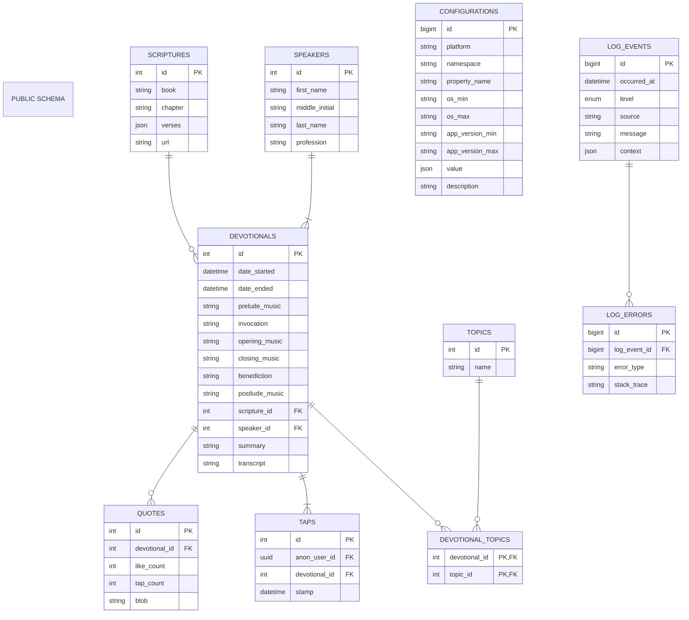

```mermaid
erDiagram "PUBLIC SCHEMA"

    SPEAKERS {
        int id PK
        string first_name
        string middle_initial
        string last_name
        string profession
    }

    SCRIPTURES {
        int id PK
        string book
        string chapter
        json verses
        string url
    }

    DEVOTIONALS {
        int id PK
        datetime date_started
        datetime date_ended
        string prelude_music
        string invocation
        string opening_music
        string closing_music
        string benediction
        string postlude_music
        int scripture_id FK
        int speaker_id FK
        string summary
        string transcript
    }

    TOPICS {
        int id PK
        string name
    }

    DEVOTIONAL_TOPICS {
        int devotional_id PK, FK
        int topic_id PK, FK
    }

    TAPS {
        int id PK
        uuid anon_user_id FK
        int devotional_id FK
        datetime stamp
    }

    QUOTES {
        int id PK
        int devotional_id FK
        int like_count
        int tap_count
        string blob
    }

    CONFIGURATIONS {
        bigint id PK
        string platform
        string namespace
        string property_name
        string os_min
        string os_max
        string app_version_min
        string app_version_max
        json value
        string description
    }

    LOG_EVENTS {
        bigint id PK
        datetime occurred_at
        enum level
        string source
        string message
        json context
    }

    LOG_ERRORS {
        bigint id PK
        bigint log_event_id FK
        string error_type
        string stack_trace
    }

    %% =====================
    %% RELATIONSHIPS
    %% =====================

    SPEAKERS ||--|{ DEVOTIONALS : ""
    SCRIPTURES ||--o{ DEVOTIONALS : ""

    DEVOTIONALS ||--o{ DEVOTIONAL_TOPICS : ""
    TOPICS ||--o{ DEVOTIONAL_TOPICS : ""

    DEVOTIONALS ||--|{ TAPS : ""
    DEVOTIONALS ||--o{ QUOTES : ""

    LOG_EVENTS ||--o{ LOG_ERRORS : ""
```